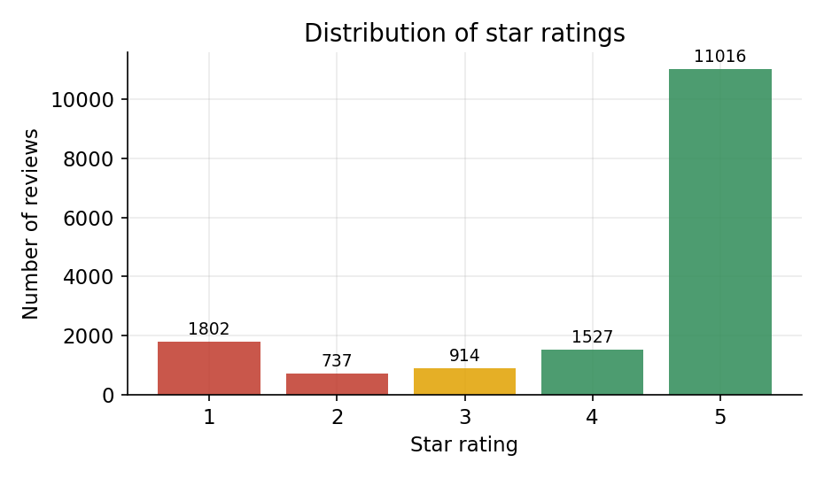
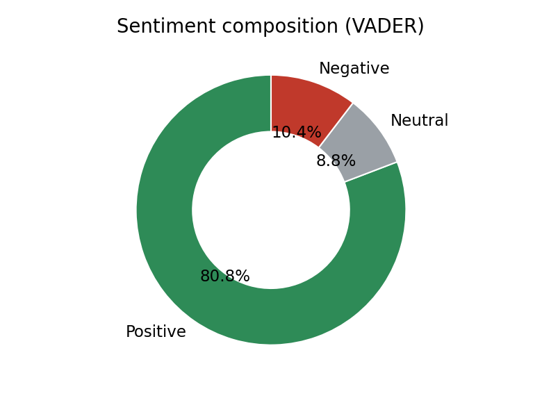
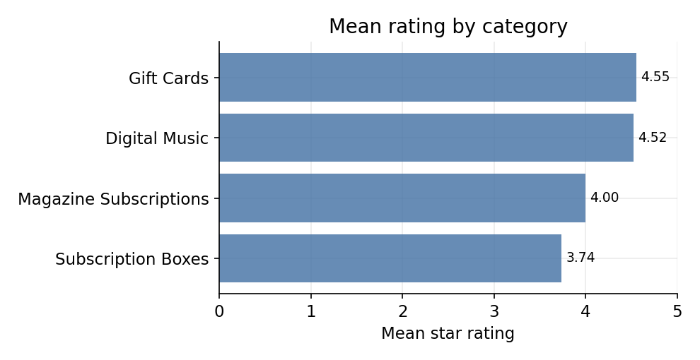
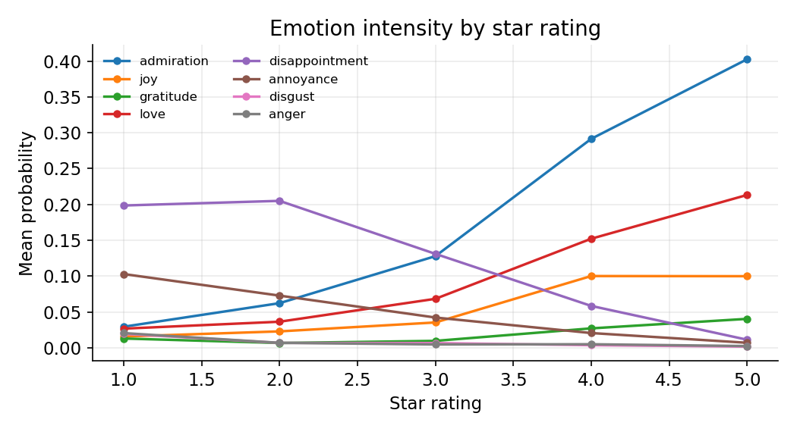
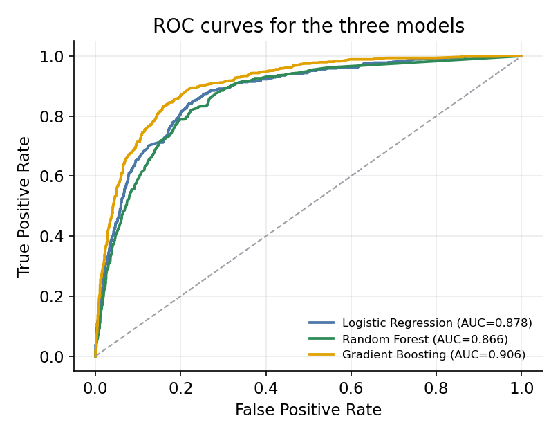
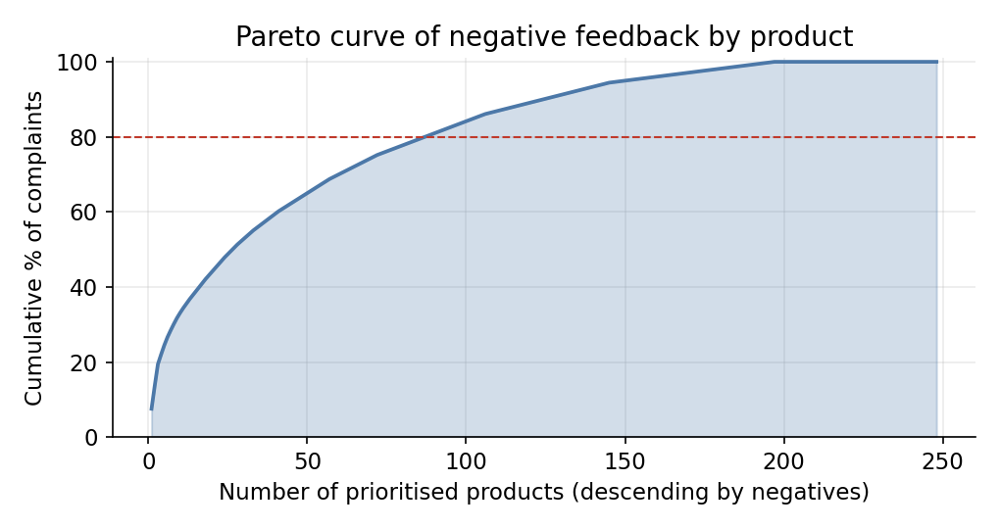

# Results

All numbers below are computed directly from the project data — no figure is
estimated or hand-tuned. Source data: [Amazon Reviews 2023](https://huggingface.co/datasets/McAuley-Lab/Amazon-Reviews-2023)
(McAuley-Lab), a balanced sample of **15,996 reviews** across four categories
(Digital Music, Gift Cards, Magazine Subscriptions, Subscription Boxes),
spanning **1998–2023**.

## 1. Descriptive: what the data looks like

| Metric | Value |
|---|---|
| Total reviews | 15,996 |
| Unique products | 5,584 |
| Mean rating | 4.20 ★ (median 5.0) |
| Positive / Neutral / Negative (VADER) | 80.8% / 8.8% / 10.4% |
| Verified purchases | 84.2% |
| Mean review length | 40 words (median 20) |

 

Ratings are strongly positive-skewed, typical of e-commerce review data. Text
sentiment is a bit less rosy than star ratings alone, since some 3–4★ reviews
still contain negative-toned sentences about a specific aspect.

### By category

| Category | Reviews | Mean rating | Negative share |
|---|---|---|---|
| Gift Cards | 3,999 | 4.55 | 6.9% |
| Digital Music | 3,998 | 4.52 | 7.8% |
| Magazine Subscriptions | 4,000 | 4.00 | 11.1% |
| Subscription Boxes | 3,999 | 3.74 | 15.8% |

Subscription Boxes is the clear outlier — lowest satisfaction, highest
negative share, longest reviews, and most helpful votes, suggesting it is
where customers are most engaged (and most vocal) about disappointment.

## 2. Diagnostic: sentiment and emotion

Fine-grained emotion is scored with a RoBERTa model trained on the
28-label **GoEmotions** taxonomy, applied to a stratified sample of 6,000
reviews (chosen to keep CPU-only inference tractable).

Positive emotions (admiration, joy, gratitude, love) rise monotonically with
star rating; negative emotions (disappointment, annoyance, disgust, anger)
concentrate at 1–2★ and fall as rating increases — a clean separation that is
itself evidence the model is picking up genuine signal rather than noise.

**Because there is no gold emotion label on Amazon reviews**, quality is
validated indirectly against the star rating instead of measured directly:

| Indirect validation metric | Value |
|---|---|
| Mean confidence of the top emotion label | 0.739 |
| Share of reviews with confidence ≥ 0.5 | 85.3% |
| Mean rating when predicted emotion is positive | 4.71 |
| Mean rating when predicted emotion is negative | 2.00 |
| Polarity agreement with star rating (n=4,422) | 94.3% |
| Correlation (net positive emotion, star rating) | 0.667 |

This agreement is at the coarse positive/negative level, not per-emotion
accuracy — GoEmotions is a hard 28-way task (published macro-F1 ≈ 0.4–0.5
even on its native domain), so fine-grained labels should be trusted less
than the broad polarity split.

## 3. Predictive: forecasting negative reviews

Three classifiers predict whether a review is negative (rating ≤ 2, 15.9% of
the data) from four features: VADER sentiment score, word count, helpful
votes, and verified-purchase flag.

| Model | AUC | Precision | Recall | F1 |
|---|---|---|---|---|
| **Gradient Boosting** | **0.906** | 0.678 | 0.553 | 0.609 |
| Logistic Regression | 0.878 | 0.444 | 0.781 | 0.566 |
| Random Forest | 0.866 | 0.557 | 0.524 | 0.540 |

Gradient Boosting wins on AUC, but **Logistic Regression is what the
dashboard deploys** — it has by far the highest recall (0.781), meaning it
catches most true negative reviews, and its coefficients are directly
interpretable (sentiment score: −2.83, the dominant driver; verified
purchase: −0.75; helpful votes: +0.07).

## 4. Prescriptive: where to focus limited resources

Products with ≥ 8 reviews (248 total, 935 negative reviews combined) are
ranked by negative-review count and prioritised with a Pareto analysis:

| Products addressed | Share of total | Complaints covered |
|---|---|---|
| 5 | 2.0% | 24.5% |
| 10 | 4.0% | 33.2% |
| 20 | 8.1% | 44.1% |

Fewer than 2% of products account for a quarter of all complaints — a
customer-care team with limited bandwidth gets far more value triaging by
this ranking than working through products in an arbitrary order.

## Summary

| Question | Answer |
|---|---|
| What does the data look like? | Positive-skewed (mean 4.20★), Subscription Boxes is the weak category |
| Is the emotion signal trustworthy? | Yes at the polarity level (94.3% agreement, r=0.667); less so per fine-grained emotion |
| Which model predicts negative reviews best? | Gradient Boosting (AUC 0.906); Logistic Regression deployed for recall + interpretability |
| Where should support effort go? | 5 products resolve ~24.5% of all negative feedback |

---

Full methodology, theoretical framework, and citations are in [README.md](README.md).
